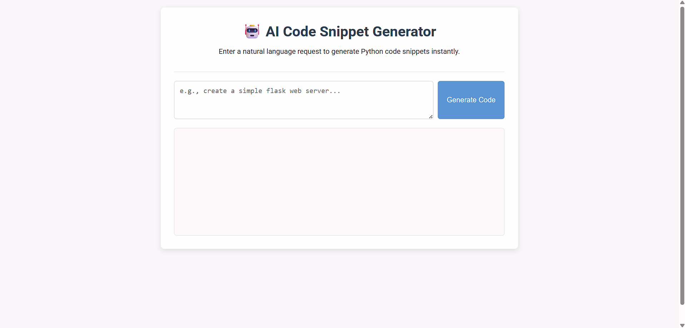

# 🧠 Application Code Snippet Generator Agent

An AI-powered web application that generates programming code snippets from natural language input.  
Users can type a request and instantly receive a relevant code snippet.

---

## 🚀 Features

- Natural language to code generation  
- Generates Python code snippets  
- Simple web interface  
- Uses LLM APIs  
- Easy to extend  

---

## 🧰 Tech Stack

- Python  
- Flask  
- HTML, CSS, JavaScript  
- Groq / OpenAI API  

---

## 🖼️ Screenshots

### Home Page


### Working


---

## 📁 Project Structure  
application-code-snippet-generator-agent/  
├── app.py  
├── requirements.txt  
├── .env.example  
├── .gitignore  
├── README.md  
├── LICENSE  
├── templates/  
│ └── index.html  
├── static/  
│ ├── style.css   
└── screenshots  

---

## ⚙️ Installation

```bash
git clone https://github.com/kaushikbargaway/application-code-snippet-generator-agent.git
cd application-code-snippet-generator-agent
python -m venv venv
venv\Scripts\activate      # Windows
source venv/bin/activate  # Linux/Mac
pip install -r requirements.txt
```
---

## 📜 License

This project is licensed under the **MIT License**.

---

## 👤 Author

Kaushik Kumar  
B.E. – Information Science Engineering  
GitHub: https://github.com/kaushikbargaway  
LinkedIn: https://www.linkedin.com/in/kaushikbargaway  


